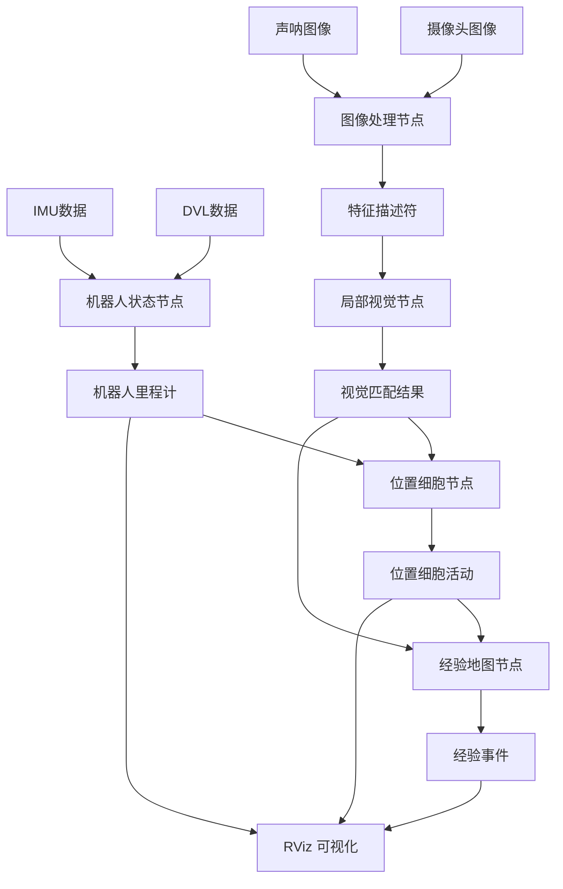

# Dolphin SLAM - 水下自主航行器生物启发 SLAM 系统


## 🌊 项目简介

Dolphin SLAM 是一个专门为水下自主航行器（AUV）设计的生物启发 SLAM 系统，基于 ROS2 平台开发。该系统模拟海洋生物的空间认知机制，结合前向摄像头和声呐数据，实现水下环境的鲁棒导航与建图。

### 🧠 生物启发原理

本系统模拟了以下生物神经机制：
- **位置细胞网络**：基于海马体位置细胞的 3D 连续吸引子神经网络（CANN）
- **局部视觉细胞**：模拟视皮层的场景识别机制，集成 FAB-MAP 算法
- **经验地图**：类似动物的拓扑-度量混合空间表征

### 🎯 核心特性

- 🔍 **多传感器融合**：同时处理前向摄像头和声呐图像
- 🧠 **生物启发算法**：位置细胞网络、局部视觉细胞、经验地图
- 🌐 **ROS2 集成**：完整的 ROS2 生态系统支持
- 📊 **实时可视化**：RViz2 3D 可视化和调试界面
- 🔧 **高度可配置**：支持多种特征提取算法和参数调优
- 💻 **跨平台支持**：Linux 和 macOS（包括 M2 芯片优化）

## 📁 项目架构

```
dolphin_slam_ws/
├── dolphin_slam/          # 核心 Python 模块
│   ├── __init__.py
│   ├── image_processing.py      # 图像处理模块
│   ├── local_view_cells.py      # 局部视觉细胞
│   ├── place_cell_network.py    # 位置细胞网络
│   ├── experience_map.py        # 经验地图
│   ├── robot_state.py          # 机器人状态估计
│   ├── fabmap.py               # FAB-MAP 算法
│   └── utils.py                # 工具函数
├── nodes/                 # ROS2 节点
│   ├── image_processing_node.py
│   ├── local_view_node.py
│   ├── place_cell_node.py
│   ├── experience_map_node.py
│   ├── robot_state_node.py
│   └── dataset_player_node.py
├── msg/                   # ROS2 消息定义
│   ├── Descriptors.msg
│   ├── PlaceCellActivity.msg
│   ├── ExperienceEvent.msg
│   ├── LocalViewMatch.msg
│   └── RobotOdometry.msg
├── srv/                   # ROS2 服务定义
│   ├── ImageRequest.srv
│   ├── SaveMap.srv
│   ├── LoadMap.srv
│   └── ResetSLAM.srv
├── launch/                # 启动文件
│   ├── dolphin_slam_launch.py
│   └── dolphin_slam_enhanced_launch.py
├── config/                # 配置文件
│   ├── dolphin_slam_params.yaml
│   └── camera_calibration.yaml
├── rviz/                  # RViz 配置
│   └── dolphin_slam.rviz
├── scripts/               # 工具脚本
│   ├── analyze_dataset.py
│   └── visualize_results.py
├── test/                  # 测试文件
│   ├── test_image_processing.py
│   ├── test_place_cell_network.py
│   └── test_experience_map.py
├── start_dolphin_enhanced.sh  # 快速启动脚本
└── CMakeLists.txt
```

## 🔧 核心模块详解

### 1. 图像处理模块 (`image_processing.py`)

负责处理来自摄像头和声呐的图像数据：

**主要功能：**
- 多种特征提取算法（SURF、SIFT、ORB）
- 自适应对比度增强（CLAHE）
- 水下图像特有的噪声处理
- 特征描述符生成和匹配

**关键算法：**
- **SURF 特征检测**：快速且鲁棒的角点检测
- **图像增强**：针对水下低对比度环境的 CLAHE 算法
- **特征匹配**：基于 FLANN 的快速最近邻匹配

### 2. 局部视觉细胞 (`local_view_cells.py`)

模拟视皮层的场景识别机制：

**主要功能：**
- 视觉模板管理和存储
- FAB-MAP 概率场景识别
- 视觉词汇表构建和训练
- 场景相似度计算

**生物原理：**
- 模拟哺乳动物视皮层的局部视觉细胞
- 通过视觉模板匹配实现场景识别
- 概率框架处理环境变化和光照影响

### 3. 位置细胞网络 (`place_cell_network.py`)

基于海马体位置细胞的 3D 空间表征：

**主要功能：**
- 3D 连续吸引子神经网络（CANN）
- 位置编码和解码
- 网络动力学更新
- 空间记忆维护

**数学模型：**
```
τ dU/dt = -U + ρ ∫ J(x,x') r(x',t) dx' + I_ext(x,t)
```

**关键特性：**
- **连续吸引子**：维持稳定的空间表征
- **竞争性学习**：通过侧抑制实现空间选择性
- **可塑性**：根据经验调整空间表征

### 4. 经验地图 (`experience_map.py`)

构建拓扑-度量混合地图：

**主要功能：**
- 经验节点创建和管理
- 拓扑连接建立
- 闭环检测和处理
- 地图优化和修正

**数据结构：**
- **经验节点**：包含位置、朝向、视觉模板ID
- **拓扑连接**：经验节点间的邻接关系
- **度量信息**：精确的距离和角度测量

### 5. 机器人状态估计 (`robot_state.py`)

多传感器数据融合：

**主要功能：**
- IMU 数据处理
- DVL 速度估计
- 扩展卡尔曼滤波（EKF）
- 姿态和位置估计

**传感器融合：**
- **IMU**：角速度和加速度
- **DVL**：相对地面速度
- **视觉里程计**：相机帧间运动

## 🗂️ 数据流架构



## 📊 支持数据集

### AUV 多传感器数据集

项目使用 Zenodo 上的 AUV 数据集：
**数据集链接：** https://zenodo.org/records/10544811

**数据组成：**
- **前向摄像头**：Allied-Vision Manta G-917
  - 分辨率：1692×1355 像素
  - 帧率：2 Hz
  - 位深：8-bit
  
- **前向声呐**：Blueprint Oculus M1200d
  - 工作频率：1.2 MHz
  - 最大探测距离：40m（设置为20m）
  - 水平孔径：130°
  - 分辨率：902×497 像素

- **导航数据**：GPS、DVL、IMU 融合
  - 位置：纬度、经度、深度
  - 姿态：俯仰、横滚、偏航
  - 速度：三轴速度分量

**数据集特点：**
- **采集地点**：以色列红海埃拉特海岸
- **采集环境**："太阳船"沉船遗址和 EAPC 码头桩柱
- **数据量**：约 8000 对 FLC-FLS 样本
- **深度范围**：10-15 米
- **总大小**：约 8000 对同步的摄像头-声呐图像
- **时间同步**：所有传感器数据都有精确的时间戳对应
- **标定信息**：包含摄像头内参和声呐配置参数
- **环境多样性**：包含沉船、人工结构物等多种水下场景
- **数据质量**：经过预处理，适合直接用于 SLAM 算法开发

**下载建议：**
- 数据集较大，建议使用稳定的网络连接
- 可以使用 `wget` 或 `curl` 命令行工具下载
- 支持断点续传功能

### 数据格式

从 Zenodo 下载的数据集格式：
```
dataset/
├── camera/                 # 摄像头图像
│   ├── 00001.png
│   ├── 00002.png
│   └── ...
├── sonar/                  # 声呐图像
│   ├── 00001.png
│   ├── 00002.png
│   └── ...
├── navigation.csv          # 导航数据
├── camera.csv             # 摄像头时间戳映射
├── sonar.csv              # 声呐时间戳映射
└── samples.json           # 多模态样本关联
```

**导航数据格式（navigation.csv）：**
- `timestamp`: Unix 时间戳 (秒)
- `latitude`: 纬度 (度)
- `longitude`: 经度 (度)
- `altitude`: 高度 (米)
- `yaw`: 偏航角 (度)
- `pitch`: 俯仰角 (度)
- `roll`: 横滚角 (度)
- `velocity_x`: X 轴速度 (m/s)
- `velocity_y`: Y 轴速度 (m/s)
- `velocity_z`: Z 轴速度 (m/s)
- `depth`: 深度 (米)

## 🚀 快速开始

### 1. 环境准备

**系统要求：**
- Ubuntu 22.04 LTS 或 macOS 12+
- ROS2 Humble Hawksbill
- Python 3.8+
- OpenCV 4.5+

**安装依赖：**
```bash
# 更新系统
sudo apt update

# 安装 ROS2 依赖
sudo apt install -y \
    python3-pip \
    python3-opencv \
    python3-numpy \
    python3-scipy \
    python3-matplotlib \
    python3-sklearn \
    ros-humble-cv-bridge \
    ros-humble-tf2-ros \
    ros-humble-visualization-msgs \
    ros-humble-rviz2

# 安装 Python 包
pip3 install \
    opencv-contrib-python==4.5.5.64 \
    transforms3d \
    tqdm
```

### 2. 构建项目

```bash
# 创建工作空间
mkdir -p ~/dolphin_slam_ws
cd ~/dolphin_slam_ws

# 直接克隆项目到工作空间（无需 src 目录）
git clone <your-repo-url> .

# 构建项目
colcon build --symlink-install
source install/setup.bash
```

### 3. 配置数据集

下载数据集：
```bash
# 从 Zenodo 下载数据集
wget https://zenodo.org/records/10544811/files/dataset.zip
unzip dataset.zip
```

编辑 `config/dolphin_slam_params.yaml`：

```yaml
dataset:
  base_path: "/path/to/your/AUV-Dataset"
  camera_path: "/path/to/your/AUV-Dataset/camera"
  sonar_path: "/path/to/your/AUV-Dataset/sonar"
  navigation_csv: "/path/to/your/AUV-Dataset/navigation.csv"
```

### 4. 运行系统

```bash
# 使用增强版快速启动脚本
./start_dolphin_enhanced.sh

# 或指定数据集路径
./start_dolphin_enhanced.sh -d /path/to/AUV-Dataset
```

## 📈 性能优化

### ARM64 (M2) 优化配置

```yaml
# 降低计算负载
image_processing:
  max_features: 500          # 从 1000 降低
  hessian_threshold: 600     # 提高阈值减少特征点
  
place_cell:
  neurons_per_dimension: 16  # 从 20 降低
  update_rate: 5.0          # 降低更新频率
  
performance:
  reduce_features: true
  reduced_network_size: 16
```

### 实时性能调优

```yaml
# 处理频率优化
image_processing:
  process_every_n_frames: 2  # 隔帧处理
  enable_gpu_acceleration: true
  
local_view:
  vocabulary_size: 500       # 减少词汇表大小
  max_templates: 2000        # 限制模板数量
  
experience_map:
  max_experiences: 1000      # 限制经验节点数
  enable_pruning: true       # 启用地图修剪
```

## 📊 系统监控

### 关键性能指标

| 指标 | 目标值 | 描述 |
|------|--------|------|
| 图像处理频率 | 5-10 FPS | 特征提取和匹配 |
| 特征匹配延迟 | < 50ms | 局部视觉细胞响应 |
| 位置细胞更新 | < 10ms | 神经网络动力学 |
| 地图更新延迟 | < 20ms | 经验地图维护 |
| 内存使用 | < 2GB | 系统总内存占用 |

### 监控命令

```bash
# 查看节点状态
ros2 node list
ros2 topic hz /dolphin_slam/place_cells/activity

# 性能分析
ros2 run dolphin_slam slam_monitor.py

# 数据集分析
ros2 run dolphin_slam analyze_dataset.py /path/to/dataset
```

## 🔧 参数配置

### 主要配置文件

**`dolphin_slam_params.yaml`** - 系统主配置：

```yaml
# 图像处理参数
image_processing:
  feature_type: "SURF"        # SURF, SIFT, ORB
  max_features: 1000
  hessian_threshold: 400
  enable_clahe: true
  clahe_clip_limit: 3.0

# 位置细胞网络参数
place_cell:
  neurons_per_dimension: 20
  sigma: 0.5
  learning_rate: 0.01
  recurrent_weight: 0.8
  
# 经验地图参数
experience_map:
  match_threshold: 0.75
  loop_closure_threshold: 0.8
  min_experience_age: 5
  
# 可视化参数
visualization:
  enable_rviz: true
  publish_markers: true
  marker_scale: 0.1
```

## 🧪 测试和验证

### 单元测试

```bash
# 运行所有测试
colcon test --packages-select dolphin_slam

# 运行特定测试
python3 -m pytest test/test_image_processing.py -v
python3 -m pytest test/test_place_cell_network.py -v
python3 -m pytest test/test_experience_map.py -v
```

### 集成测试

```bash
# 使用测试数据集
ros2 launch dolphin_slam dolphin_slam_launch.py \
    dataset_path:=/test/data/small_dataset \
    debug:=true

# 验证输出
ros2 topic echo /dolphin_slam/experience_map/markers
```

## 📚 扩展开发

### 添加新的特征提取器

```python
# 在 image_processing.py 中
def _init_feature_detector(self):
    if self.feature_type == 'YOUR_DETECTOR':
        self.detector = YourCustomDetector()
        self.logger.info(f"使用自定义特征检测器")
```

### 实现新的神经网络模型

```python
# 继承 PlaceCellNetwork 基类
class YourCustomNetwork(PlaceCellNetwork):
    def __init__(self, **kwargs):
        super().__init__(**kwargs)
        self.custom_parameters = kwargs.get('custom_params', {})
    
    def apply_recurrent_dynamics(self):
        # 实现您的自定义动力学
        pass
```

### 集成新传感器

```python
# 在 robot_state_node.py 中
def setup_sensor_subscriptions(self):
    # 添加新传感器订阅
    self.new_sensor_sub = self.create_subscription(
        YourSensorMsg,
        '/your_sensor/data',
        self.new_sensor_callback,
        10
    )
```

## ❓ 常见问题

### Q: OpenCV 找不到 SURF/SIFT 特征？
**A:** 安装 opencv-contrib-python：
```bash
pip uninstall opencv-python
pip install opencv-contrib-python==4.5.5.64
```

### Q: 在 M2 Mac 上性能较低？
**A:** 使用 ARM64 优化配置：
```yaml
performance:
  reduce_features: true
  reduced_network_size: 16
  max_features: 500
```

### Q: 词汇表训练失败？
**A:** 确保有足够的训练数据：
```bash
# 检查数据集
python3 scripts/analyze_dataset.py /path/to/dataset

# 手动训练词汇表
ros2 service call /local_view/train_vocabulary std_srvs/srv/Trigger
```

### Q: 内存使用过高？
**A:** 调整以下参数：
```yaml
local_view:
  max_templates: 2000      # 降低模板数量
  template_decay_rate: 0.99 # 加速模板衰减

experience_map:
  max_experiences: 1000    # 限制经验节点
  enable_pruning: true     # 启用地图修剪
```

## 📖 相关论文

### 核心理论基础

1. **Silveira, L., Guth, F., Drews Jr, P., & Ballester, P.** (2015). "An open-source bio-inspired solution to underwater SLAM." *IFAC-PapersOnLine*, 48(2), 212-217.
   - 本项目的理论基础，提出了水下 SLAM 的生物启发解决方案

### 相关研究

2. **Milford, M., & Wyeth, G.** (2012). "SeqSLAM: Visual route-based navigation for sunny summer days and stormy winter nights." *ICRA 2012*.
   - 序列化 SLAM 方法，处理外观变化

3. **Ball, D., et al.** (2013). "OpenRatSLAM: an open source brain-based SLAM system." *Autonomous Robots*.
   - 开源生物启发 SLAM 系统实现

4. **Cummins, M., & Newman, P.** (2008). "FAB-MAP: probabilistic localization and mapping in the space of appearance." *The International Journal of Robotics Research*.
   - FAB-MAP 概率定位与建图算法

5. **Burgess, N., et al.** (2007). "Spatial memory: how egocentric and allocentric combine." *Trends in Cognitive Sciences*.
   - 空间记忆的生物学基础

## 🤝 贡献指南

欢迎提交 Issues 和 Pull Requests！

### 贡献步骤：
1. Fork 项目
2. 创建特性分支 (`git checkout -b feature/AmazingFeature`)
3. 提交更改 (`git commit -m 'Add AmazingFeature'`)
4. 推送到分支 (`git push origin feature/AmazingFeature`)
5. 创建 Pull Request

### 代码规范：
- 遵循 PEP 8 Python 代码风格
- 添加必要的注释和文档字符串
- 确保所有测试通过

## 📄 许可证

本项目采用 Apache License 2.0 许可证。详细信息请参阅 [LICENSE](LICENSE) 文件。

## 🙏 致谢

- Silveira, L. 等人的开源生物启发 SLAM 理论基础
- 原始 Dolphin SLAM 算法的研究团队
- FAB-MAP 算法的实现者
- ROS2 社区的支持和贡献
- DeeperSense 项目（欧盟 H2020 基金支持）
- Zenodo 数据集提供者

## 📧 联系方式

如有问题或建议，请通过以下方式联系：

- 📧 邮箱：[sunshiyu123@gmail.com]
- 🐛 Issues：[项目 GitHub Issues 页面]
- 💬 讨论：[项目讨论区]

---

**🌊 探索水下世界，从 Dolphin SLAM 开始！**
